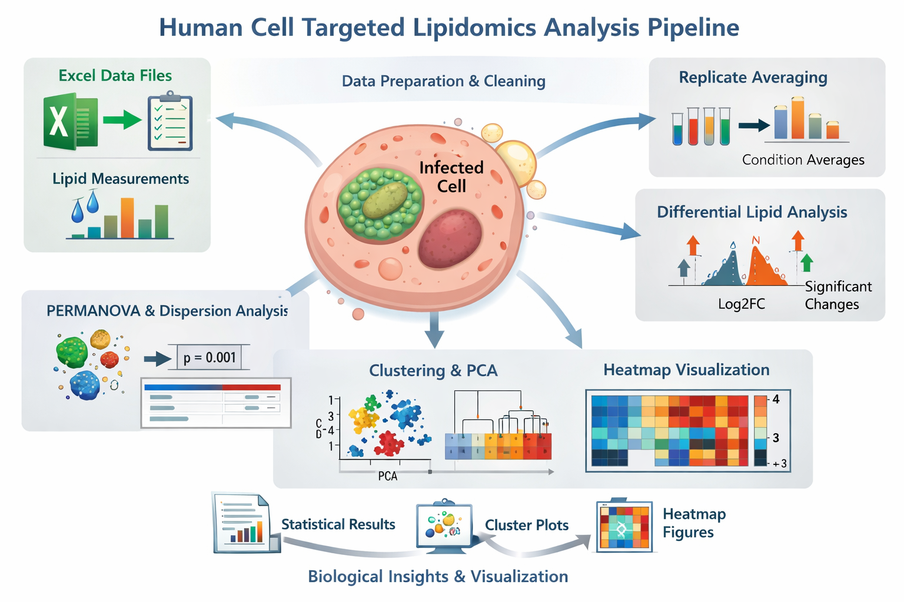

## Related publication

**Chlamydia-like bacterium _Simkania negevensis_ exploits host sphingolipids for infection and progeny formation**

Mohanty, A., Weinrich, J. D., Das, S., Rühling, M., Schumacher, F., Seibel, J., Fraunholz, M., Kleuser, B., and Kozjak-Pavlovic, V.

## Overview

This repository contains scripts and documentation for lipidomics data analysis in R.  
It includes workflows for:

- data import and cleaning
- replicate averaging
- heatmap generation
- multivariate statistics
- PERMANOVA and dispersion testing
- downstream visualization and exploratory analysis

## Repository structure

```text
├─ README.md
├─ docs/
│  ├─ heatmap_average_replicates.md
│  ├─ differential_lipid_heatmap.md
│  └─ ...
├─ scripts/
│  ├─ heatmap_average_replicates.R
│  ├─ differential_lipid_heatmap.R
│  ├─ permanova_inhibitor_analysis.R
│  └─ ...
└─ images/
   ├─ hist_raw_values.png
   ├─ hist_log10_values.png
   ├─ density_raw_vs_log.png
   └─ qqplot_residuals.png
```
## Getting started

This file lays the foundation of lipidomics analysis including multivariate statistics and visualizations.

Before running the analysis scripts, make sure your working environment is set up correctly.

## Knitting prerequisites

Use the following setup chunk in R Markdown files to suppress unnecessary messages and warnings during rendering:

```r
knitr::opts_chunk$set(
  message = FALSE,
  warning = FALSE
)
```

## Clear environment if needed

```r
rm(list = ls())
```

## Check or set directory and load saved file if needed

```r
getwd()
setwd("<YOUR DIRECTORY>")
load("lipidomics.RData")
```

## Load required packages

```r
library(readxl)
library(scales)
library(dplyr)
library(purrr)
library(stringr)
library(vegan)
library(broom)
library(ggplot2)
library(emmeans)
library(janitor)
library(devtools)
library(pairwiseAdonis)
library(pheatmap)
library(writexl)
library(tidyr)
library(ggrepel)
library(rcompanion)
library(ggpubr)
library(MASS)
library(tools)
library(tibble)
```

## Input data

The analysis scripts generally expect Excel files containing:

* sample metadata
* treatment or inhibitor information
* infection status
* lipid measurement columns

Specific input requirements are described in the corresponding files in the `docs/` folder.

## How to use this repository

* Read the relevant instruction file in `docs/` before running a script.
* Open the matching `.R` file from the `scripts/` folder.
* Replace placeholder file paths or directory paths with your own.
* Check that column names and factor labels in your dataset match the expected format.
* Run the script in R or RStudio after loading the required packages.

