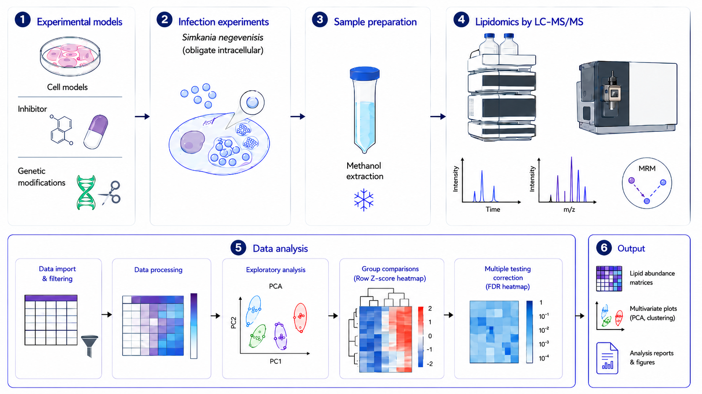

# Targeted lipidomics analysis of sphingolipid metabolism during _Simkania negevensis_ infection



## Related publication

**Chlamydia-like bacterium _Simkania negevensis_ exploits host sphingolipids for infection and progeny formation**

Mohanty, A., Weinrich, J. D., Das, S., Rühling, M., Schumacher, F., Seibel, J., Fraunholz, M., Kleuser, B., and Kozjak-Pavlovic, V.

## Overview

This repository contains R scripts and documentation for the analysis of targeted lipidomics data from human cells infected with _Simkania negevensis_.

The analysis workflow includes:

- data import and preprocessing
- data cleaning and quality assessment
- replicate averaging
- lipid abundance visualization
- heatmap generation
- multivariate statistical analysis
- PERMANOVA and dispersion testing
- downstream exploratory visualization

## Repository structure

```text
├─ README.md
├─ docs/
│  ├─ heatmap_average_replicates.md
│  ├─ differential_lipid_heatmap.md
│  └─ ...
├─ scripts/
│  ├─ heatmap_average_replicates.R
│  ├─ differential_lipid_heatmap.R
│  ├─ permanova_inhibitor_analysis.R
│  └─ ...
└─ images/
   ├─ hist_raw_values.png
   ├─ hist_log10_values.png
   ├─ density_raw_vs_log.png
   └─ qqplot_residuals.png
```

## Getting started

Before running the analysis scripts, make sure that R and the required packages are installed.

Recommended R packages include:

```r
tidyverse
pheatmap
vegan
ggplot2
readxl
janitor
```

Install missing packages with:

```r
install.packages(c(
  "tidyverse",
  "pheatmap",
  "vegan",
  "ggplot2",
  "readxl",
  "janitor"
))
```

## Running the analysis

Scripts are located in the `scripts/` directory. Each script performs a specific part of the lipidomics workflow.

For example:

```r
source("scripts/heatmap_average_replicates.R")
source("scripts/differential_lipid_heatmap.R")
source("scripts/permanova_inhibitor_analysis.R")
```

Detailed explanations of selected workflows are provided in the `docs/` directory.

## Outputs

The scripts generate exploratory plots, heatmaps, and statistical summaries for lipid abundance patterns across experimental conditions.

Typical outputs include:

- raw and log-transformed value distributions
- replicate-averaged heatmaps
- differential lipid abundance heatmaps
- PERMANOVA results
- dispersion test results
- diagnostic plots

## Notes

Input data files are not included in this repository unless explicitly stated. Please ensure that file paths inside the scripts are adjusted to match your local data directory.

## Citation

If you use this repository or adapt the analysis workflow, please cite the related publication listed above.

## License

Please add license information here, for example MIT, GPL-3, or institutional-use only.
