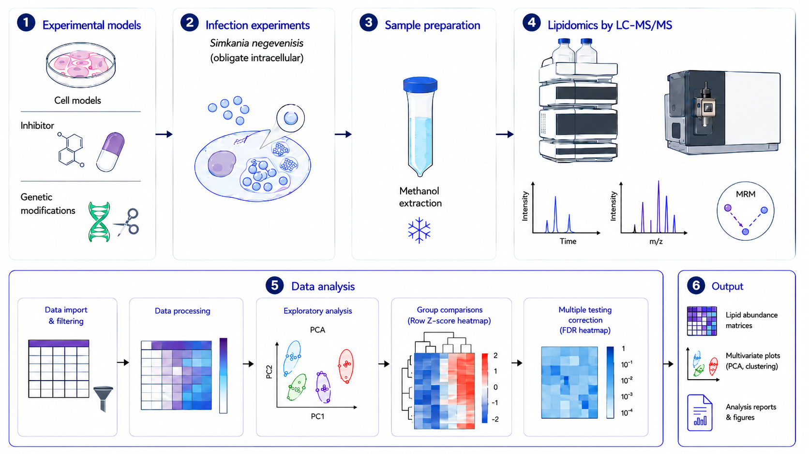

# Targeted lipidomics analysis of sphingolipid metabolism during _Simkania negevensis_ infection



## Related publication

**Chlamydia-like bacterium Simkania negevensis exploits host sphingolipid salvage pathway and sphingomyelin synthesis during infection**

Mohanty, A., Weinrich, J. D., Schumacher, F., Rühling, M., Sunuwar, S., Szegedi, H., Wigger, D., Schmelz, F., Panda, B. K., Kappe, C., Brenner, D., Schirmer, M., Arenz, C., Seibel, J., Holthuis, J. C. M., Das, S., Fraunholz, M., Kleuser, B., and Kozjak-Pavlovic, V.

## Overview

This repository contains R scripts and documentation for the analysis of targeted lipidomics data from human cells infected with _Simkania negevensis_.

The analysis workflow includes:

- data import and preprocessing
- data cleaning and quality assessment
- replicate averaging
- lipid abundance visualization
- heatmap generation
- multivariate statistical analysis
- PERMANOVA and dispersion testing
- isotope-tracer incorporation kinetics and absolute labelled-abundance analysis
- downstream exploratory visualization

## Repository structure

```text
├─ README.md
├─ REPRODUCIBILITY.md
├─ CITATION.cff
├─ LICENSE
├─ demo_data/
│  ├─ README.md
│  └─ sms12_demo_lipidomics.xlsx
├─ documents and instructions/
│  ├─ transformation_diagnostics.md
│  ├─ sms12_manova_pca_dispersion_analysis.md
│  ├─ sms12_individual_lipids_permanova_dispersion_analysis.md
│  ├─ cell_line_pairwise_fdr_lipid_heatmap.md
│  ├─ custom_pairwise_lipid_contrast_heatmap.md
│  ├─ pairwise_fdr_lipid_heatmap.md
│  └─ ...
├─ scripts/
│  ├─ transformation_diagnostics.R
│  ├─ sms12_manova_pca_dispersion_analysis.R
│  ├─ sms12_individual_lipids_permanova_dispersion_analysis.R
│  ├─ cell_line_pairwise_fdr_lipid_heatmap.R
│  ├─ custom_pairwise_lipid_contrast_heatmap.R
│  ├─ pairwise_fdr_lipid_heatmap.R
│  ├─ isotope_tracer_flux_analysis.Rmd
│  ├─ incorporation_kinetics_fixed_analysis.Rmd
│  ├─ pal_d3_pooled_absolute_analysis.R
│  ├─ d7_pooled_absolute_analysis.R
│  ├─ isotope_tracer_sensitivity_benchmark.Rmd
│  └─ ...
└─ images/
   ├─ hist_raw_values.png
   ├─ hist_log10_values.png
   ├─ density_raw_vs_log.png
   └─ qqplot_residuals.png
```

## Getting started

Before running the analysis scripts, make sure that R and the required packages are installed.

Required CRAN packages used across the scripts include:

```r
readxl
janitor
dplyr
stringr
purrr
tidyr
tibble
ggplot2
pheatmap
vegan
emmeans
broom
writexl
rcompanion
scales
knitr
```

For a reproducible package environment, use the versions recorded in [`renv.lock`](renv.lock):

```r
install.packages("renv")
renv::restore()
```

Alternatively, install missing packages manually with:

```r
install.packages(c(
  "readxl",
  "janitor",
  "dplyr",
  "stringr",
  "purrr",
  "tidyr",
  "tibble",
  "ggplot2",
  "pheatmap",
  "vegan",
  "emmeans",
  "broom",
  "writexl",
  "rcompanion",
  "scales",
  "knitr"
))
```

The `tools` package ships with R and is loaded by scripts that need it.

## Running the analysis

Scripts are located in the `scripts/` directory. Each script performs a specific part of the lipidomics workflow.

Each script is intended to run as a standalone analysis file after you install the required packages listed above and update the user-defined input/output paths near the top of the script. The scripts load their own libraries with `library()` calls, so you do not need to source another project file first.

For example:

```r
source("scripts/transformation_diagnostics.R")
source("scripts/pairwise_fdr_lipid_heatmap.R")
source("scripts/sms12_manova_pca_dispersion_analysis.R")
```

Detailed explanations of selected workflows are provided in the `documents and instructions/` directory.

For step-by-step reproducibility instructions, including Zenodo input-file mapping and example run commands, see [`REPRODUCIBILITY.md`](REPRODUCIBILITY.md).

A small synthetic demo workbook is provided in [`demo_data/`](demo_data/) for installation checks and reviewer testing.

## Isotope-tracer analysis

The isotope-tracer workflows are integrated with the rest of the repository
under `scripts/`. They keep three related quantities distinct:

- fractional incorporation, used for endpoint-specific kinetic-trajectory models;
- absolute labelled abundance in `pmol/sample`, used for categorical-time interaction models and timepoint contrasts; and
- the optional `fmol/pmol total sphingolipids` workbook block, used only as a sensitivity comparison.

The primary absolute analyses use `log10(value + 0.01)` for statistical
models while plotting untransformed values. Pal-d3 class endpoints combine d3
and d6 signals for the relevant 16:0 species. The d7 class endpoints combine
d7-16:0, d7-24:0, and d7-24:1. Labelled LCB molecules remain separate.

| Script | Purpose |
| --- | --- |
| `isotope_tracer_flux_analysis.Rmd` | Imports the Pal-d3 and d7-dhSph workbooks, validates their layouts, creates species-level tidy tables, and runs supporting AUC and interaction analyses. |
| `pal_d3_pooled_absolute_analysis.R` | Tests eight Pal-d3 absolute endpoints, including d3+d6 class pools, with experiment-wide BH correction. |
| `d7_pooled_absolute_analysis.R` | Tests nine d7 absolute endpoints, including pooled labelled classes and individual labelled LCB molecules. |
| `incorporation_kinetics_fixed_analysis.Rmd` | Fits the retained endpoint-specific fractional-incorporation kinetic models on the original clock-time axis. |
| `isotope_tracer_sensitivity_benchmark.Rmd` | Benchmarks raw versus log10 models, pseudovalue choices, absolute versus normalized blocks, and isotope-pooling definitions. |

The line-plot `curve FDR` is the BH-adjusted infection-by-time interaction
p-value. Timepoint comparisons are estimated from the same interaction model
with `emmeans`, then adjusted across all endpoint-by-time contrasts in the
relevant tracer experiment. The benchmark measures robustness of effect
directions and FDR conclusions; it does not treat absolute abundance,
normalized measurements, and fractional incorporation as interchangeable.

Exact commands, required workbook names, output paths, and run order are given
in [`REPRODUCIBILITY.md`](REPRODUCIBILITY.md).

## Input data availability

Primary experimental input data files are not included in this repository. They are deposited in Zenodo:

Das, S., & Mohanty, A. (2026). *Targeted lipidomics analysis of sphingolipid metabolism during Simkania negevensis infection* (v.2) [Data set]. Zenodo. https://doi.org/10.5281/zenodo.18866967

The Zenodo record is currently under embargo. Access to files may be restricted until the embargo is lifted.

Please ensure that file paths inside the scripts are adjusted to match your local data directory.

## Outputs

The scripts generate exploratory plots, heatmaps, and statistical summaries for lipid abundance patterns across experimental conditions.

Typical outputs include:

- raw and log-transformed value distributions
- replicate-averaged heatmaps
- pairwise comparison and fdr heatmaps
- PERMANOVA results
- dispersion test results
- diagnostic plots
- isotope-labelled species and pooled-class time courses
- infection-by-time and `emmeans` contrast tables
- isotope-analysis sensitivity benchmark tables and figures

Generated results are written below `outputs/` and are not part of the source
repository.

## Versioning

This repository follows semantic versioning. Version `1.1.0` adds the
isotope-tracer analysis and sensitivity-benchmarking workflows without
changing the existing targeted-lipidomics interfaces.

## Contact

For questions about the lipidomics analysis pipeline, scripts, or reproducibility, please contact:

**Sudip Das**  
Email: sudip.das@tum.de

**Arpita Mohanty**  
Email: arpita.mohanty@uni-wuerzburg.de

## Citation

If you use this repository or adapt the analysis workflow, please cite the related publication. Citation metadata is available in [`CITATION.cff`](CITATION.cff), and GitHub will show a “Cite this repository” option for it.

## License

This repository is licensed under the Creative Commons Attribution 4.0 International License (CC BY 4.0). See [`LICENSE`](LICENSE) for details.
