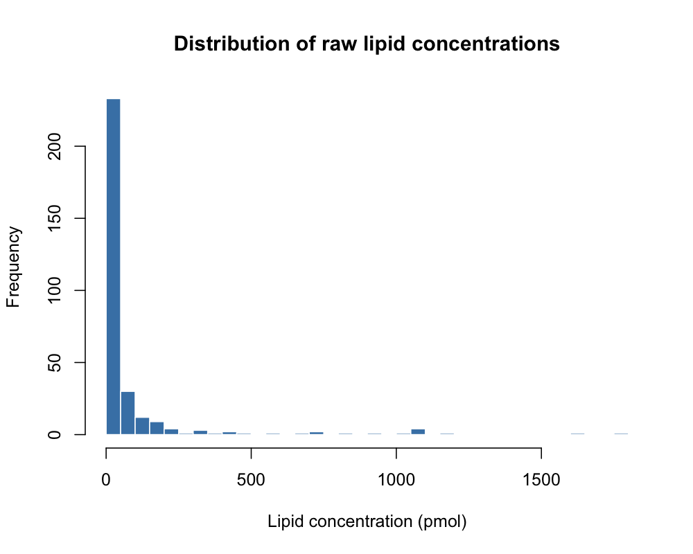
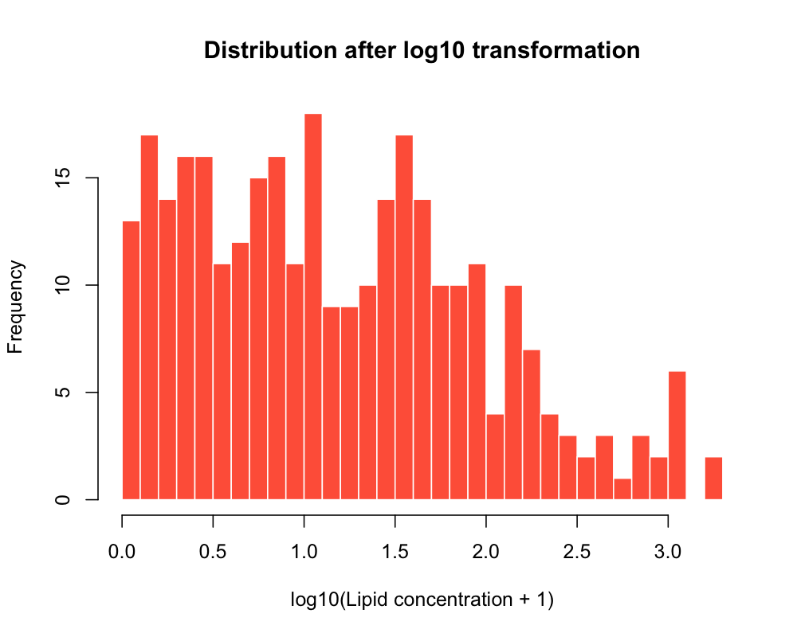
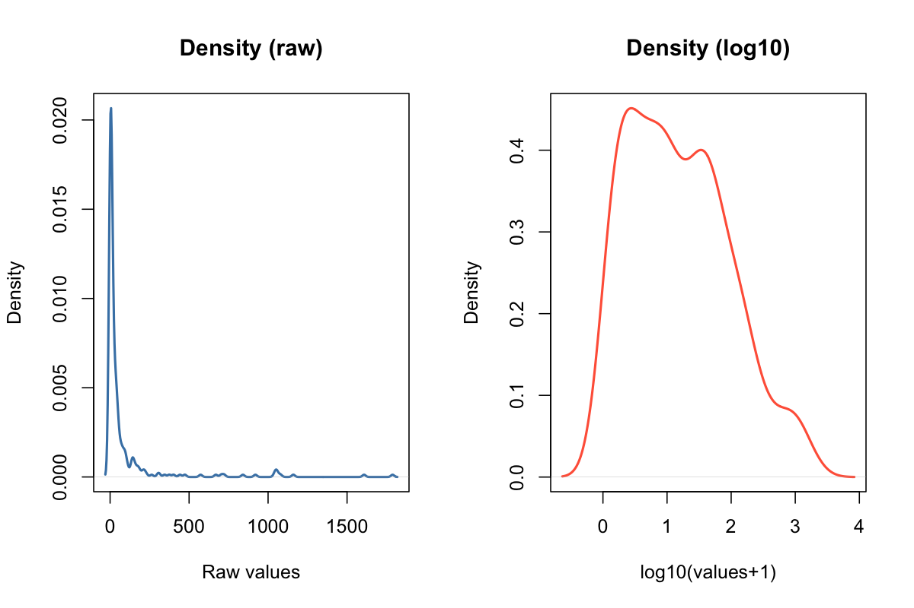
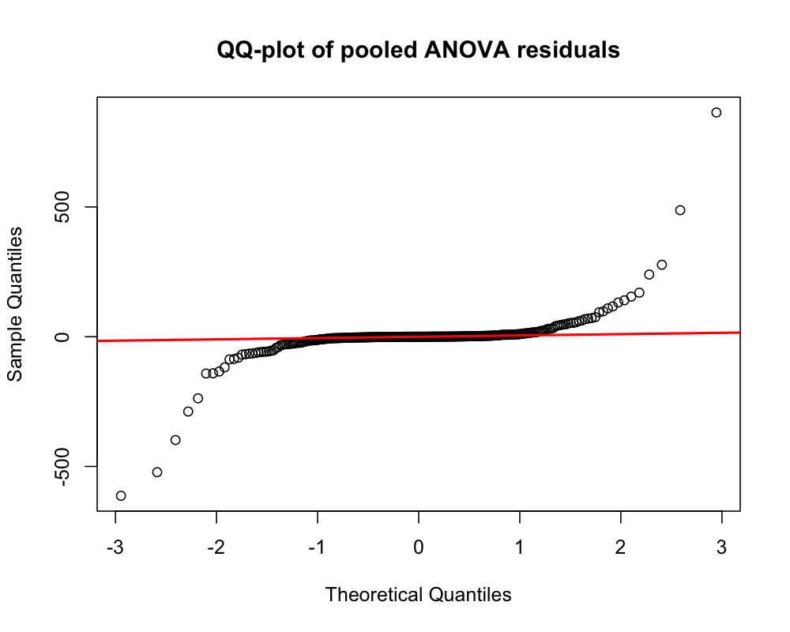

# Transformation diagnostics

This document explains how to use the script `scripts/transformation_diagnostics.R`.

## Instructions

- Open `scripts/transformation_diagnostics.R`.
- Set the raw input Excel file and output directory:

```r
input_file <- "path/to/your/input_file.xlsx"
out_dir <- "path/to/your/output_directory"
```

- Leave `sheet_name <- NULL` to read the first worksheet, or set it to a specific Excel sheet name:

```r
sheet_name <- "your_sheet_name"
```

- Add any non-lipid metadata columns to `metadata_cols` so they are excluded from the lipid diagnostics.
- Use cleaned column names in `metadata_cols`; for example, `Cell Line` becomes `cell_line`.
- Make sure your dataset contains a column named `infection`, because it is used for the ANOVA residual check.
- Make sure lipid measurement columns contain numeric values, or values that can be converted to numeric.
- Check the generated diagnostic `.png` files in the diagnostics output folder.

## Overview

This script generates diagnostic plots to inspect the distribution of lipid values before and after log10 transformation, and to assess pooled ANOVA residual normality.

## Required R packages

The script uses:

```r
readxl
janitor
```

Install missing packages before running the script.

## Input requirements

The script expects a raw Excel file specified by:

```r
input_file <- "path/to/your/input_file.xlsx"
```

The Excel file must contain:

* one row per sample
* a column named `infection`
* lipid measurement columns
* optional metadata columns listed in `metadata_cols`

## Specific lines you may need to edit

Update the input file, sheet name, output directory, and metadata columns:

```r
input_file <- "path/to/your/input_file.xlsx"
sheet_name <- NULL
out_dir <- "path/to/your/output_directory"
metadata_cols <- c("infection", "condition", "inhibitor", "cell_line")
```

Use `sheet_name <- NULL` to read the first worksheet.

## What the script does

The script:

* creates a `diagnostics` subfolder inside the main output directory
* reads the raw Excel input file
* cleans column names with `janitor::clean_names()`
* identifies lipid columns by excluding `metadata_cols`
* coerces candidate lipid columns to numeric
* extracts all lipid values into one vector
* plots a histogram of raw lipid values
* plots a histogram of log10-transformed lipid values
* plots density curves for raw and log10-transformed values
* calculates pooled residuals from one-way ANOVA models using `infection` as predictor
* generates a QQ-plot of pooled ANOVA residuals
* saves all plots as `.png` files

## Output

The script writes the following files to the diagnostics output directory:

- `hist_raw_values.png`
- `hist_log10_values.png`
- `density_raw_values.png`
- `density_log10_values.png`
- `qqplot_residuals.png`

## Example plots

<p>
  
  
</p>

<p align="center">
  
</p>

<p align="center">
  
</p>

## Notes

* The cleaned input data must contain an `infection` column.
* The script creates `df` and `lipid_cols` directly from the raw input file.
* The QQ-plot uses pooled residuals across all lipid-wise ANOVA models.
* The script does not return a main summary object.
* If a metadata column is not listed in `metadata_cols`, it may be treated as a lipid column if it contains numeric values.
